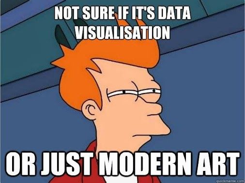
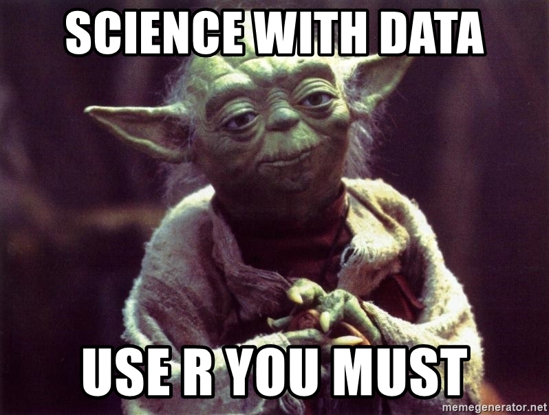

 

# Welcome

Hi there! Welcome to my personal homepage. My name is Liucheng Shi. 

This page also served as the homework design of P8105.I generate this page using Rstudio.

Please scroll down or use the navigation bar on the top/left

 

# My R learning history {.tabset}

## Before attending mailman

 

## Taking Jeff's P8105

 
__R is everything!!!__

# Resume and plots

*   [About me](about.html)
*   [Plot Flexdashboard](plots.html)

# Other materials

### About this course

* [P8015](https://p8105.com/index.html)

* [Columbia Biostatistics](https://www.publichealth.columbia.edu/academics/departments/biostatistics)

### Data scientists' selections

* [RMarkdown website tutorial](https://nickstrayer.me/RMarkdown_Sites_tutorial/)

* [Jeff's regular expression](https://docs.google.com/presentation/d/1rLNJVyWuIEQqkqTWUlCY4G-l7H610wM1IRz3CL67Gec/edit#slide=id.p)

